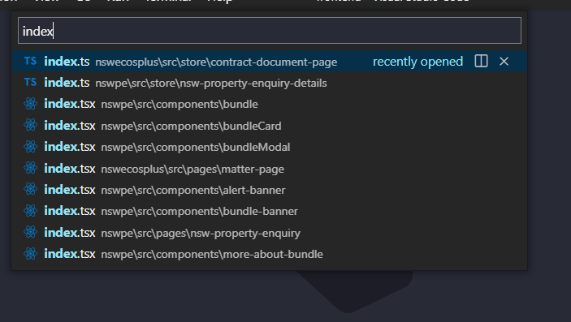
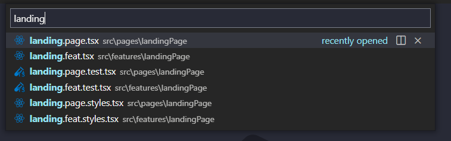
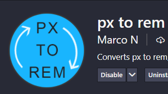

# Zenith New Project Template

## How to use this template:

First you must clone the repo and remove the remote so you don't override the template with your new code.

```
git clone https://github.com/InfoTrackGlobal/ZenithTemplate.git
```

```
git remote remove origin
```

Now add your own remote

```bash
git remote add origin ${YourRepo}
```

To run the demo and install dependencies.

```bash
  npm i && npm start
```

---

## Building your project

We give you an express server ready to go in

```
  📦server
   ┗ 📜server.js
```

You just need to update the name of you application do a <kbd>Cmd</kbd> +<kbd>shift</kbd>+ <kbd>f</kbd>
for `XXXXX`

- two places inside `index.html`
- line 10 `server.js` the name of your application
- line 17 Dockerfile ( it references XXXX)

---

<br />
<br />

# About the template

```
 npm run start
```

<section>
Out of the Box we give you:

- Latest Zenith Version
- Routing
- React testing library and jest
- Server.js and Dockerfile
- linting
- git hooks
- Zenith theme
- working React Context
- GA Analytics with useAnalyticsContext
</section>

## Folder structure choices

The folders are broken down into categories, all folders should use `camelCase`.

The folders we give you are

```
📂server
📂assets
📦src
 ┣ 📂components
 ┣ 📂context
 ┣ 📂features
 ┣ 📂models
 ┣ 📂router
 ┣ 📂utils

```

To help newer staff, and make it easier to traverse the repo we want to avoid this:

<br />



Index files are great for exporting multiple components, like an index in a book, you don't need one for each component, **_just give it a name_**.

## We also append each file with it's type to make it super easy to know which is which

- `data.context.tsx`
- `cssBreakpoints.utils.ts`
- `unitLoader.tests.tsx`
- `unitLoader.styles.tsx`

---

We do still have an `index.ts` in each folder so you can still have pretty imports,
for example

```js
// components/ index.tsx
export * from './inputComponent/inputComponent';
export * from './formComponent/formComponent';

// inside /features/form.feat.tsx
import { FormComponent } from '../../components';
```

So file names are a bit longer, you still get nice imports but

<div> Searching with <kbd>Ctrl</kbd> or <kbd>Cmd</kbd> + <kbd>P</kbd>
is much nicer when you have named files.

  

<aside>
  <em>just trust us!</em> 
</aside>
It seems ugly but it's actually super helpful when you start using it especially when things start having similar names.
</div>
<br />
<br />

# Technology choices

State managment is done with React context

[Official Docs](https://reactjs.org/docs/context.html)

If you're familiar with Redux this should be easy, it's a big object of properties passed down the tree.
But you can also create new contexts which you can partially pass down to your components that need them.
This is a nice balance between state in one place and reduced complexity.

Keep your context files in the context folder under src directory

For complicated features they can have their own `/context` directory inside the feature it self

```
📦src
 ┣ 📦context
 ┃  ┣ 📜analytics.context.tsx
 ┃  ┣ 📜data.context.tsx
 ┃  ┗ 📜index.ts
```

<br />

# Components

The components folder should house all the shared components, that are used in `one or more` features.

Each component should have it's own folder with one file for the component named the same as the component, one file for tests and one for styles.

_It is up to you to deside what qualifies as a component and how you would like to test it._

```
📦components
 ┣ 📂formComponent
 ┃ ┣ 📜formComponent.tsx
 ┃ ┣ 📜formComponent.fx.tsx
 ┃ ┣ 📜formComponent.styles.tsx
 ┃ ┣ 📜formComponent.test.tsx
 ┃ ┗ 📜schemas.tsx
 ┣ 📂inputComponent
 ┃ ┗ 📜inputComponent.tsx
 ┃ ┣ 📜inputComponent.styles.ts
 ┃ ┣ 📜inputComponent.test.tsx
 ┗ 📜index.ts
```

<br />
<br />

## Side Effects (Api calls)

Components or features can handle their own side effects, we recommend an additional file in the folder with `.fx` in the name

```
📦components
 ┣ 📂formComponent
 ┃ ┣ 📜formComponent.fx.tsx

```

Then you can import either as named exports or `import * as FX` and use them in your code.

for example

```js
//  inside  `component.fx.tsx`
export const fetchData = (id: string) => {
  // some api call
};

// inside component.tsx
import * as FX from './component.fx.tsx';

useEffect(() => {
  FX.fetchData('123');
});
```

### Styles using Theme-ui

We use the theme-ui package for styling and theming of Zenith components. This means that we have moved away from using sass and traditional css in favour of css-in-js.

include the following at the top of your `.styles.ts` files

```js
import { ThemeUIStyleObject } from 'theme-ui';
```

This gives you access the Zenith themeProvider, and access to breakpoint system
[read-more here](https://www.figma.com/file/r3kZKBHyNrpIeHU0KBFWw4/Zenith-Component-Library?node-id=3733%3A15120)

Component styles are written in the component's respective `.styles.tsx` file and imported into the main component file. From here they are applied to the respective element using the [sx prop](https://theme-ui.com/sx-prop/)

Styles are written as objects in the same format as you would write a style to be applied onto a React element using the styles prop using camelCase.

theme-ui will automatically attempt to match values to a value in the theme (e.g. `color: 'b-400'` will attempt to find the `b-400` value in the theme: `colors object`).

please use `rem` when doing styles not `px` you can download a nifty converter extentsion called

- `px to rem` by Marco N



---

Don't forget to add the following code to your `.tsx` files that use the `sx prop`, otherwise your styles won't render correctly.

```js
// inside your component
/**  @jsxImportSource theme-ui  */

import * as styles from './thisComponent.styles.tsx`
```

<br />

# Features Folder

Features represent larger parts of your application, and are generally a combination of components, and other logic, usually with their own routes these are kept in `/features`

These are appended with `.feat` and also follow our appended fileName Philosophy to allow for easier Searching.

If you have a complex feature that has some components that are not shared with other features you can include them as a subfolder inside

If you have shared logic or api calls, we recommend moving it up to either the feature layer or into the shared `src/components` folder

```
features
 ┣ 📂itemFeature
 ┃ ┣ 📜itemFeature.feat.tsx
 ┃ ┣ 📜itemFeature.feat.fx.tsx
 ┃ ┣ 📜itemFeature.feat.styles.tsx
 ┃ ┣ 📜itemFeature.feat.test.tsx
 ┃ 📂dashBoard
 ┃  ┣ 📂dashboardComponents
 ┃  ┃  ┣📂wrappedInput
 ┃  ┃  ┣ 📜wrappedInput.tsx
 ┃  ┃  ┣ 📜wrappedInput.styles.tsx
 ┃  ┃  ┣ 📜wrappedInput.test.tsx
 ┃  ┗ 📜dashBoard.tsx
 ┃  ┣ 📜dashBoard.fx.tsx
 ┃  ┣ 📜dashBoard.styles.ts
 ┃  ┣ 📜dashBoard.test.tsx
 ┗ 📜index.ts


```

# Models Folder

This is a good place to store any complex typings or shared data structures you might need.

<br />

# Routing

We use `React-router-dom` for Routing, it's the main entry point to the application and is wrapped by all our context providers.

You can read more about it on their [docs](https://reactrouter.com/web/guides/quick-start)

It is available inside `src/router/Router.tsx`

```js
📦router
 ┗ 📜Router.tsx
```

## Testing

We've included [React-testing-library](https://testing-library.com/docs/react-testing-library/intro/) and [jest](https://jestjs.io/)
out of the box, with a dummy component that shows you how to implement basic usage.

To run the tests use:

```
 npm run test
```

There is a `testWrapper.utils.tsx` file which wraps and our tests in `Zenith` and our `ContextProvider` you will need to update it to include any additional providers you make.

<br />

# Integration and e2e testing

We don't have any solid plans on how this should be done yet, Cypress.io or puppetteer are both great, but don't support IE11.

PR's welcome if you've got ideas for this.

<br />

# Development tools (Ready to go)

In order to enforce code consistency, we use:

- **EditorConfig**: this is [just a file](https://editorconfig.org/) placed in our project's root folder, which defines the code style for the project,
  If you are using VS Code, just paste the following: _publisher:"EditorConfig"_ in the extensions searchbar and install the _EditorConfig for VS Code_

- **StyleLint**: this is [a linter](https://editorconfig.org/) for our css, to enable support for it in VS Code, install the **stylelint** plugin by _Shinnosuke Watanabe_ available in the VS Code's extensions marketplace. Check the `.stylelintrc` file in the root folder to change our lint rules.

- **Prettier**: A [formatter](https://prettier.io/docs/en/why-prettier.html) for JS/TS code. Is highly recommended to install the **Prettier - Code formatter** extension by _Esben Petersen_ to set Prettier as your formatter in VS Code, it will take the configuration defined in the `.prettier.config.js` file in the root folder.

- **ESLint**: A [linter](https://github.com/eslint/eslint) for our TS code. Get the **ESLint** plugin by _Dirk_Baeumer_ to integrate ESLint with VS Code.

- **Husky**: [git hooks](https://typicode.github.io/husky/#/) Husky enforces our git hook, which can be customised inside `husky.config.js`

- **Commitizen**: [standardised commit messages](https://github.com/commitizen/cz-cli) after staging your files, you can run `npm run commit` to get a guided walkthrough of a standadised commit template.

<strong>PRS WELCOME</strong>
